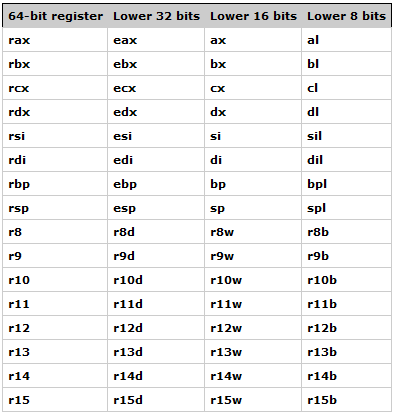

# Introduction to assembly

<!-- You are eager to learn or to know what is assembly, and how the binary executable works, so you are here. -->

In the first grade README.md, we have followed to successfully run the first assembly program, and the terminal prints `Hello world!`.

<!-- From now on, let's start diving into the basic knowledgement of assembly. -->

Let's look at "Hello, World" example first, compare it to gcc's implementation of function `puts`:

## "Hello, World" example

We use makefile to build main.asm:

        make run # make && ./main

Let's take a look at the code:

```asm
; Definition of the `data` section.
section .data
    ; 0xa == \n, so msg = "Hello, World\n"
    msg db "Hello, World", 0xa
    ; $ means current address, $ subtract pointer msg address, results msg.length.
    len_msg equ $-msg
; Definition of the `text` section, code will write here.
section .text
    ; reference to the entry point of our program.
    global _start
; Code entry point.
_start:
    ; specify the number of the system call(1 is `sys_write`).
    mov rax, 1
    ; set the first argument of `sys_write`(`sys_write` need three arguments).
    mov rdi, 1
    ; set the msg address to the second argument of `sys_write`.
    mov rsi, msg
    ; set the third arugment.
    mov rdx, len_msg
    ; call the `sys_write` system call.
    syscall
; Add a label, it is just a signature, code will continue going,
; until meet `ret` or `jump` to stop going down.
.exit:
    ; specify the number of the system call(60 is `sys_exit`).
    mov rax, 60
    ; set the first argument of `sys_exit` to 0, then program will exit correctly.
    mov rdi, 0
    ; call system call.
    syscall
```

If you type `man 2 write` in linux CMD line, it prints out `ssize_t write(int fd, const void*buf, size_t count);` function description, it follows syscall's format, and you read more [here](https://github.com/torvalds/linux/blob/master/arch/x86/entry/syscalls/syscall_64.tbl) or [here](https://www.chromium.org/chromium-os/developer-library/reference/linux-constants/syscalls/).

After successfully get the result of the example, we are now more familiar to the construction of this language.

<!-- This prints result "Hello, World". -->

## Basic Concepts

<!-- Let's start learning how this really execute. -->

<!-- Execution is triggered by entry point as `_start` label, which label is set to visible by command `global`, then evaluate later on. -->

Before a program can execute, there are two steps need to be done:

* Compilation to an [object file](https://en.wikipedia.org/wiki/Object_file)
* Building an executable from the object files with a [linker](https://en.wikipedia.org/wiki/Linker_(computing)).

> A linker sets the entry point in the resulted executable file. That is why we must specify the entry point in the `.text` section of our program so that the linker can find it.

Program consists by diagram like below:

```asm
; this is comment line

; Definition of a section block,
; and this block is .data block, using for initializing memory data.
section .data
    ; this part contains initialized memory data.
; Definition of a section block, .text block contains logic code.
section .text
    ; assign the executable's entry point, expose it to linker
    global _start
_start:
; [label:] instruction [operands] [; comment]
```

<!-- Just like example: -->

<!-- ```asm
section .text
    global _start
_start:
    ...
.exit:
    mov rax, 0
    ...
``` -->

Section includes information with variables or codes, it is the first step we should get to know.

Besides `section`, there are some parts, such as `registers`(nasm x86_64 general-purpose registers); `instructions`(common instruction: [mov|jmp|call|ret|syscall]); `sys calls`; program `stack`; `heap`.

### Section

<!-- Code usually consists of two main elements: the code itself and comments. Comments in assembly start with the `;` symbol. -->

Assembly has 4 kinds of section:

- `.data`: initialize at stack memory(high address)
- `.bss`: reserve space at stack memory(high address too), but uninitiailize
- `.text`: code of the program
- `.shstrtab`: stores references to the existing sections

Section `.data` and `.bss` both use to define memory. `.data` will initialize data and occupy the real size at the executable binary; while `.bss` takes place real size at runtime.

The most use of sections are `.data` and `.text`. Every program is a set of instructions that tell the computer how to perform a specific task.

Each executable file on Linux x86_64 is represented in the [ELF](https://en.wikipedia.org/wiki/Executable_and_Linkable_Format) format. And ELF file has a table of sections that a program consists of. We can see a list of sections in our `main` program from the `01Helloworld` directory using the [readelf](https://man7.org/linux/man-pages/man1/readelf.1.html) utility:

```
$ strip main && readelf -S main
There are 4 section headers, starting at offset 0x2028:

Section Headers:
  [Nr] Name              Type             Address           Offset
       Size              EntSize          Flags  Link  Info  Align
  [ 0]                   NULL             0000000000000000  00000000
       0000000000000000  0000000000000000           0     0     0
  [ 1] .text             PROGBITS         0000000000401000  00001000
       0000000000000027  0000000000000000  AX       0     0     16
  [ 2] .data             PROGBITS         0000000000402000  00002000
       000000000000000d  0000000000000000  WA       0     0     4
  [ 3] .shstrtab         STRTAB           0000000000000000  0000200d
       0000000000000017  0000000000000000           0     0     1
Key to Flags:
  W (write), A (alloc), X (execute), M (merge), S (strings), I (info),
  L (link order), O (extra OS processing required), G (group), T (TLS),
  C (compressed), x (unknown), o (OS specific), E (exclude),
  D (mbind), l (large), p (processor specific)
```

As we can see, there are four sections. Two of them (**text** and **data**) were defined by us while writing the assembly code. The remaining two sections were added automatically by the compiler, while we can technically define any section in our program.

<!-- Section splite a running executation into several parts, each part stores -->

### CPU registers

<!-- , 16: [rax|rbx|rcx|rdx|rsi|rdi|rbp|rsp|r8|r9|r10|r11|r12|r13|r14|r15] -->

In the `Hello, World` example, after defining section .text, we expose `_start` to the linker, and the linker will enter the actual code under label `_start:`. The `move` instruction is to place specific values into a register. This instruction expects two operands and puts the value of the second operand into the first one. But what are these `rax`, `rdi`, and `rsi`? We can read in the Wikipedia:

> A central processing unit(CPU) is the hardware within a computer that carries out the instructions of a computer program by performing the basic arithmetical, logical, and input/output operations of the system.

A CPU can store data using the main memory, while which place is relatively slow. Reading and storing data in the main memory slows down the operations because it involves complicated steps to send data requests through the control bus. Read each io speed [at link](https://samwho.dev/numbers/). To speed things up, the CPU uses small fast storage locations called **general-purpose registers**.

```
L1 cache reference = 1ns
...
...
...
Main memory reference = 100ns
```

Access to the [L1 CPU cache](https://en.wikipedia.org/wiki/CPU_cache) is **100x** times faster than access to the main memory. The processor registers are even "closer" to the processor.

Each register has a specific size and purpose. For `x86_64` CPUS, general-purpose registers include:



We can consider each register as a very small memory slot that can store a value with a size specified in the table above. For example, the rax register can contain a value of up to `64` bits, the `ax` register may contains a value of up to `16` bits, and is save in the lower 16 bits of the `rax`. Despite these registers are called **general-purpose registers**, does it means that use any register for any purpose? The simple answer is yes. We can use them to perform arithmetic, logical, data transfer and other basic operations. However, there are specific cases when you should use these registers as specified in the [Application Binary Interface](https://en.wikipedia.org/wiki/Application_binary_interface) and the [calling conventions](https://en.wikipedia.org/wiki/X86_calling_conventions) documents.

The general purpose registers are used in many different cases, like performing arithmetic and logical operations, transferring data, memory address calculation operations, passing parameters to functions and system calls, and many more.

<!-- Since the tutorials are focused on assembly for Linux `x86_64`, the registers have the following meanings: -->

### Endianness

A computer operates with bytes of data. The bytes can be stored in memory in different order. The order in which a computer stores a sequence of bytes is called **endianness**. There are two types of endianness:

- big
- little

We can imagine memory as one large array of bytes, where each byte has its own unique address. For example, let's say we have the following four bytes in memory: `AA 56 AB FF`. In the `little-endian` order, the least significant byte is stored at the smallest memory address:

|Address|Byte|
|-|-|
|0x0000000000000000|0xFF|
|0x0000000000000001|0xAB|
|0x0000000000000002|0x56|
|0x0000000000000003|0xAA|

`0xAA56ABFF`, the least significant byte `FF` is stored at the smallest meomry address in `little-endian`.

In the case of the `big-endian` order, the bytes are stored in the opposite order, so the most significant byte is stored at the smallest memory address:

|Address|Byte|
|-|-|
|0x0000000000000000|0xAA|
|0x0000000000000001|0x56|
|0x0000000000000002|0xAB|
|0x0000000000000003|0xFF|

`0xAA56ABFF`, 0xAA is the biggest byte, so in `big-endian` order, the smallest memory address stores `0xAA` - the most signficant byte.

### Data types

Assembly is not a [statically typed programming language](https://en.wikipedia.org/wiki/Category:Statically_typed_programming_languages). Usually, we work directly with a raw set of bytes. [NASM](https://nasm.us/) provides us with some helpers to define the size of daa we are operating. The fundamental data types are:

- DB - declare byte - 1 bytes - 8 bits
- DW - declare word - 2 bytes - 16 bits
- DD - declare doubleword - 4 bytes - 32 bits
- DQ - declare quadword - 8 bytes - 64 bits
- DT - 10 bytes
- DO - 16 bytes
- DY - 32 bytes
- DZ - 64 bytes

For example:

```
section .data
    ; Define a byte with the 100
    num1 db 100
    ; Define 2 bytes with the value 1024
    num2 dw 1024
    ; Define a set of characters(10 is a new line symbol in ASCII \n)
    msg db "Sum is correct", 10
```

There are also alternatives to define uninitialized storage - `RESB`, `RESW`, `RESQ`, `REST`, `RESO`, `RESY`, and `RESZ`. Thse are used similarly to `DB` - `DZ`, but in this case, we do not provide an initial value for the defined variable.

For example:

```
section .bss
    buffer resb 64
```

After defining variables, we can start using them in our program's code. To use a variable, we can refer it by name. However, there is a small thing to remember in  the NASM assembly syntax: accessing a variable by name gets us its address, not the actual value it stores:

    ; Move the address of the `num1` variable to the al register
    mov al, num1

To get the actual value located in the given address, we need to specify the variable name in square brackets:

    mov al, [num1]

### Sys calls

What do we need to write a "Hello, World" program? Usually, we just pass a `hello world` string to a library function like `printf`. But these functions typically come from the [standard library](https://en.wikipedia.org/wiki/Standard_library) of the programming language we are using. Assembly doesn't have a standard library. What should we do in this case? Well, we have at lease two options:

- Link our assembly program with the C standard library and use printf or any other function that can help us to write a text to the `stdout`.
- Use the operating system's API directly.

We will use the second way. Each operating system provides an interface that a user-level application may use to interact with the operating system. Usually, the functions of this interface are called `system calls`. The Linux kernel also provides a set of system calls to interact with it. [Here](https://github.com/torvalds/linux/blob/master/arch/x86/entry/syscalls/syscall_64.tbl) you can find the full list of system calls with their respective numbers for Linux `x86_64`. Looking at this table, we can see such entry for the `sys_write` system call:

    1	common	write			sys_write

You can learn more about Linux system calls in [manual pages](https://man7.org/linux/man-pages/man2/syscalls.2.html). To learn more about the `sys_write` system call, run the following command in the terminal:

    man 2 write

The manual page shows the following function:

    ssize_t write(int fd, const void buf, size_t count);

This function is a wrapper around the `sys_write` system call provided by the standard C library. Usually, the arguments of the system call and the wrapper function are the same. So we can assume that the `sys_write` system call is defined like this:

    ssize_t sys_write(unsigned int fd, const char* buf, size_t count);

The first six parameters are passed in the following general purpose registers(additional params will `push` to stack):

- rax - used to store temporary values. In the case of a system call, it should store the system call number.
- rdi - used to pass the first argument to a function.
- rsi - used to pass the second param.
- rdx - used to pass the third param.
- r10 - fourth param.
- r8 - fifth param.
- r9 - sixth param.

### Instructions

Here is the list of common assembly instructions used for arithmetic operations:

- ADD - Addition
- SUB - Subtraction
- MUL / IMUL - Unsigned(MUL) and Signed(IMUL) multiplication
- DIV / IDIV - Unsigned(DIV) and Signed(IDIV) division
- INC - increment
- DEC - Decrement
- NEG - Negation
- XOR

Control flow:

- JMP
- CALL
- RET
- CMP
- je(jne,jz, and so on)

String/bytes manipulations:

- REP - repeat while rcx is not zero
- MOVSB - copy a string o bytes(MOVSW, MOVSD and etc...)
- CMPSB - byte string comparison
- SCASB - byte string scanning
- STOSB - write byte to string
- CLD - reset df flag to zero
- LOADSB - load byte from rsi to al and inc rsi

Stack:

- PUSH
- POP

And so on.

### Stack

We can not dive into assembly programming without understanding one of the crucial concepts of the **x86_64**(and other ) architectures -- the [stack](https://en.wikipedia.org/wiki/Stack_(abstract_data_type)). The stack is a specific memory area in a program that is accessed in a last-iin, first-out(LIFO) pattern.

A processor has a very limited number of registers. As we already know, an **x86_64** processor provides access to only 16 general purpose registers. Often, we may need more - or even much more space - to store data. One way to solve this issue is by using the program's stack. We can look at the stack as the usual memory area but with one significant difference - its access pattern.

In the usual RAM model, we can access any byte of memory accessible to our user-level application. However, the stack is accessed using a last-in, first-out(LIFO) pattern. Two specific instructions are used to interact with the stack: one to push a value into it and another to pop a value from it:

- push - pushes the operand into the stack.
- pop - pops the top value from the stack.

The stack grows downwards, from higher memory addresses to lower ones. So, when we refer to `top of the stack`, we actually mean the memory location with the lowest address in the current stack. In other words, the top of the stack is a pointer to the element with the lowest address. The general purpose register rsp should point to the top of the stack.

> When program execute one command(`mov rax, 16`), the program stack grows. When we call a function(`call afunc`), it will jump to a label block, the program stack create new stack from the beginning and will return to original stack address util the label block end(`ret`). Refer to example: TODO.

### Heap

Heap is the memory you borrow from the system. [glibc's example](https://github.com/lattera/glibc/blob/895ef79e04a953cac1493863bcae29ad85657ee1/malloc/malloc.c#L2289) will check if you request more than 128 * 1024 bytes of data, if so, it will request system resource by `void *mmap(void *addr, size_t length, int prot, int flags, int fd, off_t offset)` API; If you request less than 128 * 1024 bytes of data, it will request program memory.

```diagram
0000000000000000000000
000     stack->    000
0000000000000000000000
0000000000000000000000
0000000000000000000000
0000000000000000000000
000     <-heap     000
0000     .bss     0000
0000     .data    0000
000  text section  000
0000000000000000000000
```

Using `brk` sample:

```c
#include <unistd.h>
// int brk(void *addr)
// void *sbrk(intptr_t increment)
int main() {
    char* ptr0 = (char*)sbrk(0); // get current address -> 0x1fc4000
    int code = brk(ptr0+10); // success: 0;
    if (code != 0) return 1;

    char* ptr1 = (char*)sbrk(0);
    printf("result address: %p\n", ptr1); // -> 0x1fc400a

    code = brk(ptr1 - 10); // free
    if (code != 0) return 1;

    char* ptr2 = (char*)sbrk(0);
    printf("result address after free: %p\n",ptr2);

    return 0;
}
```

`mmap` API is used to allocate memory space from system. If you don't return this memory, it will leak, no handler can manager this address.

## Conclusion

Now we had taken a glance at Assembly's basic information.

> Words with ref flag come from original author in [0xAX/asm](https://github.com/0xAX/asm/blob/master/content/asm_1.md) or some other articles. Not referenced at this ref phrase=_=.

## Ref

[system call table](https://www.chromium.org/chromium-os/developer-library/reference/linux-constants/syscalls/)
