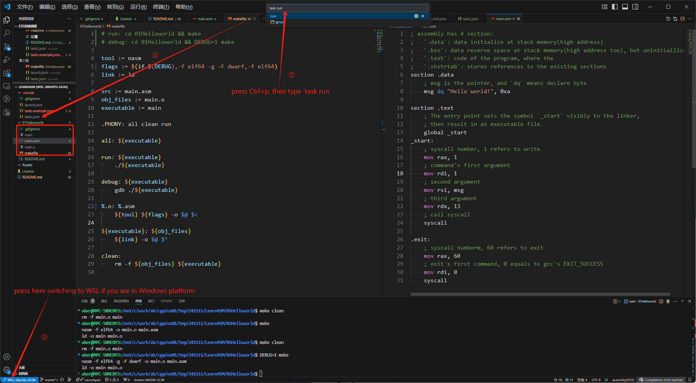

# Learn Assembly

Learn Assembly introduces how to quickly master assembly, at lease knowing how to find related documents, and essential knowledgement about assembly.

<!-- Content mostly ref to [Ref](#ref), you can read directly by original author, or learn more clear way by this documentation. -->

## Run

I work on Windows's WSL ubuntu20.04, download nasm, and Using VSCode(VSCode linking to WSL):

```
Platform    : Windows WSL - Ubuntu20.04
IDE         : VSCode - WSL:Ubuntu-20.04
Build Tool  : `sudo apt-get install gcc nasm binutils`
Makefile    : `sudo apt-get install build-essential`
```

Manually build and run:

    nasm -f elf64 -o main.o main.asm && ld -o main main.o && ./main
 <!-- Makefile is optional, you can build&&run by `nasm -f elf64 -o main.o main.asm && ld -o main main.o && ./main`. -->

Run by using vscode task:

<!-- After basic environment is ready, you can quickly run in VSCode: -->
    cp .vscode/tasks.example.json .vscode/tasks.json # copy VSCode tasks configuration
    # Press [Ctrl+p]
    # Type `task run`, then press [Enter] twice

Run in WSL terminal:

    make # or `make 0 1` to build and run one or more lessons.



## Learning List

+ [01Helloworld_english](./01Helloworld/README.english.md)
+ [02Basic_Additional_cmn_chn](./02Basic_Additional/README.cmn_chn.md)
+ [03Stack_Program_cmn_chn](./03Stack_Program/README.cmn_chn.md)
+ [04Stack_Program_cmn_chn](./04Stack_Program/README.cmn_chn.md)
+ [05Combo_Gcc_cmn_chn](./05Combo_Gcc/README.cmn_chn.md)

## Ref

[0xAX/asm](https://github.com/0xAX/asm/blob/master/content/asm_1.md)

[DGivney/assemblytutorials](https://github.com/DGivney/assemblytutorials)

## License

[License-us](./License)

[License-zh](./License.zh)

[Assembly-Cheat-Sheat](https://github.com/a7medayman6/Assembly-Cheat-Sheet)